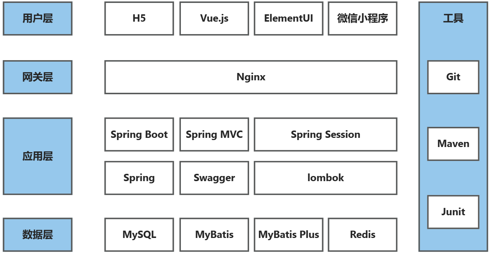
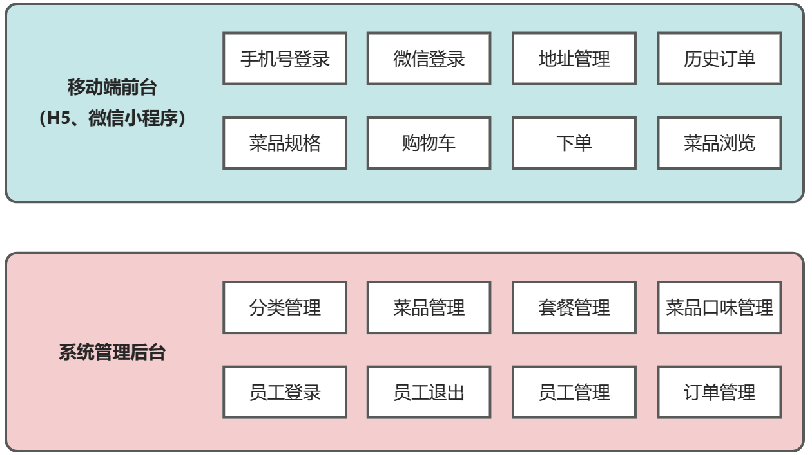

# 超级猩猩外卖

#### 介绍
本项目是专门为餐饮企业（餐厅、饭店）定制的一款软件产品，包括系统后台和移动端应用两部分。其中系统管理后台主要提供给餐饮企业内部员工使用，可对餐厅的菜品、套餐、订单等进行管理维护。移动端应用主要提供给消费者使用，可在线浏览菜品、添加购物车、下单等。

#### 技术选型

#### 功能架构

#### 数据表
| employee 员工表 |          |    |    |            |
|--------------|----------|----|----|------------|
| 字段名          | 类型       | 长度 | 说明 | 注释         |
| id           | bigint   |    | 主键非空 | 主键         |
| name         | varchar  | 32 | 非空 | 姓名         |
| username     | varchar  | 32 | 非空 | 用户名        |
| password     | varchar  | 11 | 非空 | 手机号        |
| sex          | varchar  | 2  | 非空 | 性别         |
| id_number    | varchar  | 18 | 非空 | 身份证号       |
| status       | int      |  | 非空 | 状态：0禁用，1正常 |
| create_time  | datetime |  | 非空 | 创建时间       |
| update_time  | datetime |  | 非空 | 更新时间       |
| create_user  | bigint   |   | 非空 | 创建人        |
| update_user  | bigint   |  | 非空 | 修改人        |

| category 菜品和套餐分类表 |          |    |    |                |
|-------------------|----------|----|----|----------------|
| 字段名               | 类型       | 长度 | 说明 | 注释             |
| id                | bigint   |    | 主键非空 | 主键             |
| type              | int      |    |  | 类型：1菜品分类，2套餐分类 |
| sort              | int      |  | 非空 | 顺序             |
| create_time       | datetime |  | 非空 | 创建时间           |
| update_time       | datetime |   | 非空 | 更新时间           |
| create_user       | bigint   |  | 非空 | 创建人            |
| update_user       | bigint      |    | 非空 | 修改人            |

#### 使用说明

1.  xxxx
2.  xxxx
3.  xxxx

#### 参与贡献

1.  Fork 本仓库
2.  新建 Feat_xxx 分支
3.  提交代码
4.  新建 Pull Request

#### 特技

1.  使用 Readme\_XXX.md 来支持不同的语言，例如 Readme\_en.md, Readme\_zh.md
2.  Gitee 官方博客 [blog.gitee.com](https://blog.gitee.com)
3.  你可以 [https://gitee.com/explore](https://gitee.com/explore) 这个地址来了解 Gitee 上的优秀开源项目
4.  [GVP](https://gitee.com/gvp) 全称是 Gitee 最有价值开源项目，是综合评定出的优秀开源项目
5.  Gitee 官方提供的使用手册 [https://gitee.com/help](https://gitee.com/help)
6.  Gitee 封面人物是一档用来展示 Gitee 会员风采的栏目 [https://gitee.com/gitee-stars/](https://gitee.com/gitee-stars/)
