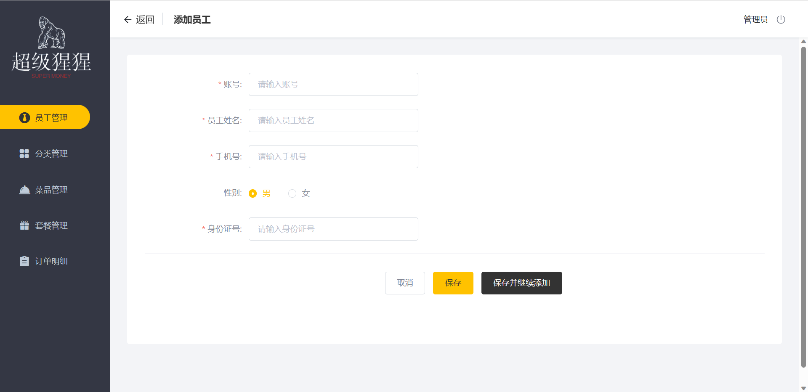
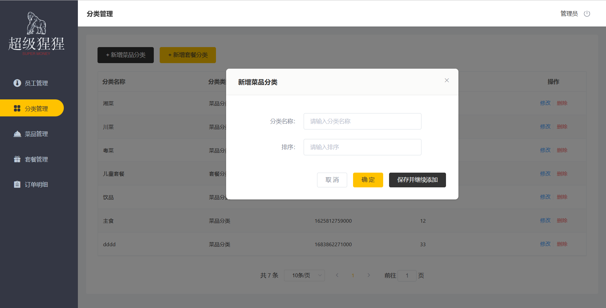

# 超级猩猩外卖

## 介绍
本项目是专门为餐饮企业（餐厅、饭店）定制的一款软件产品，包括系统后台和移动端应用两部分。其中系统管理后台主要提供给餐饮企业内部员工使用，可对餐厅的菜品、套餐、订单等进行管理维护。移动端应用主要提供给消费者使用，可在线浏览菜品、添加购物车、下单等。

## 技术选型

## 功能架构

## 目前进度
### 后台管理端
#### 账户操作
- [x] 管理员登入功能
- [x] 完善登录功能：用户未登录作拦截
- [x] 用户登出功能
#### 员工管理
- [x] 添加员工
- [x] 分页查询员工信息
- [x] 启用/禁用账号及修改账号
- [x] 编辑员工信息
#### 分类管理
- [x] 添加菜品/套餐分类
- [x] 分页查询菜品/套餐分类
- [x] 修改菜品/套餐分类
- [x] 删除分类：优化了当分类关联了菜品/套餐时，不允许被删除。并添加自定义异常处理，更优雅。

## 项目界面
### 后台管理端
#### 登录页面

#### 员工管理

#### 分类管理

## 参与贡献

1.  Fork 本仓库
2.  新建 Feat_xxx 分支
3.  提交代码
4.  新建 Pull Request

## 特技

1.  使用 Readme\_XXX.md 来支持不同的语言，例如 Readme\_en.md, Readme\_zh.md
2.  Gitee 官方博客 [blog.gitee.com](https://blog.gitee.com)
3.  你可以 [https://gitee.com/explore](https://gitee.com/explore) 这个地址来了解 Gitee 上的优秀开源项目
4.  [GVP](https://gitee.com/gvp) 全称是 Gitee 最有价值开源项目，是综合评定出的优秀开源项目
5.  Gitee 官方提供的使用手册 [https://gitee.com/help](https://gitee.com/help)
6.  Gitee 封面人物是一档用来展示 Gitee 会员风采的栏目 [https://gitee.com/gitee-stars/](https://gitee.com/gitee-stars/)
